# Lab 05 - Implement Intersite Connectivity

*20 de Enero de 2023*

## Objetivos

- **Task 1**: Aprovisionar el entorno de laboratorio.
- **Task 2**: Configurar el emparejamiento (peering) de las LAN y WAN.
- **Task 3**: Probar la conectividad entre sitios.

## Diagrama de arquitectura

## Instrucciones

### TASK 1: Aprovisionar el entorno de laboratorio.

1. Iniciamos sesión en el [portal de Azure](https://portal.azure.com/) .

2. Buscamos **Deploy a custom template** y clicamos en **Build your own template in the editor**.

   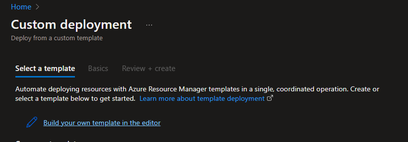

3. Después tendremos que darle a **Edit template** y luego hacemos click a **Load file** y tendremos que seleccionar el archivo **az104-05-vnetvm-template.json** y le damos a **Save**.

   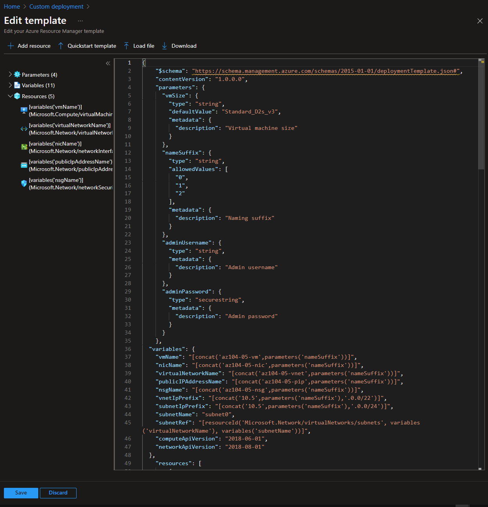

4. Después hacemos click en **Edit parameters** y después a **Load file**.

5. Seleccionaremos nuestro otro archivo llamado **az104-05-vnetvm-parameters.json** y tendremos que cambiar la contraseña. Después le daremos a **Save**.

   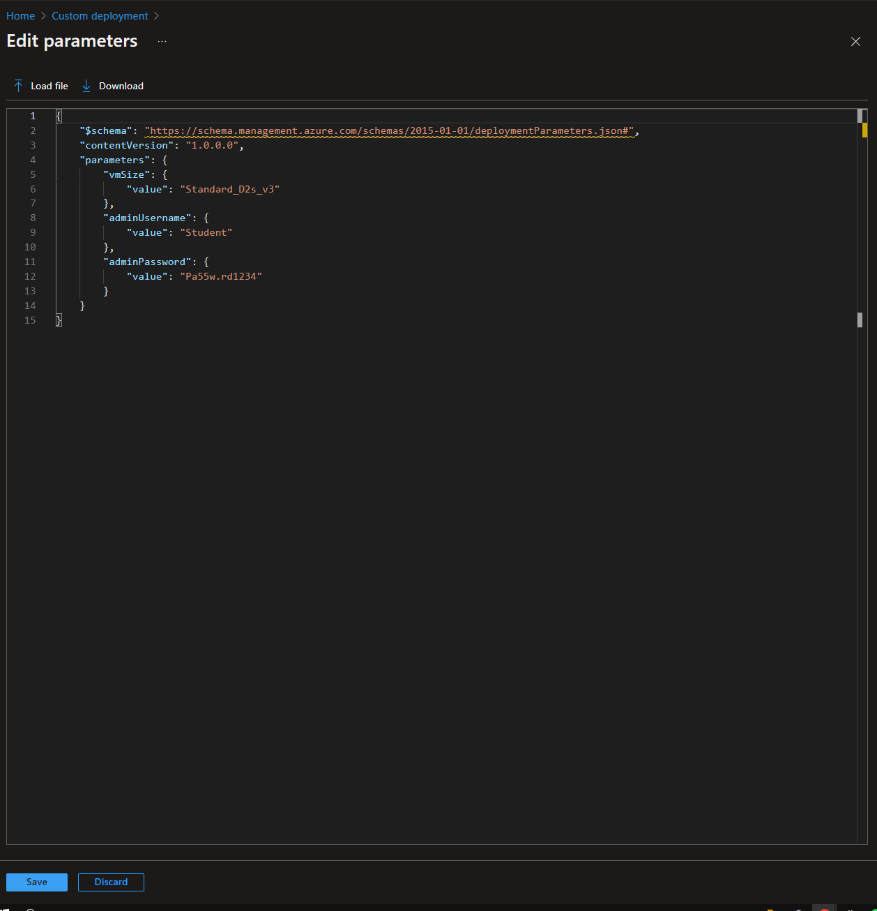

6. Completaremos los demás datos con la siguiente configuración. Después le daremos a **Review + create** y después a **Create**.

   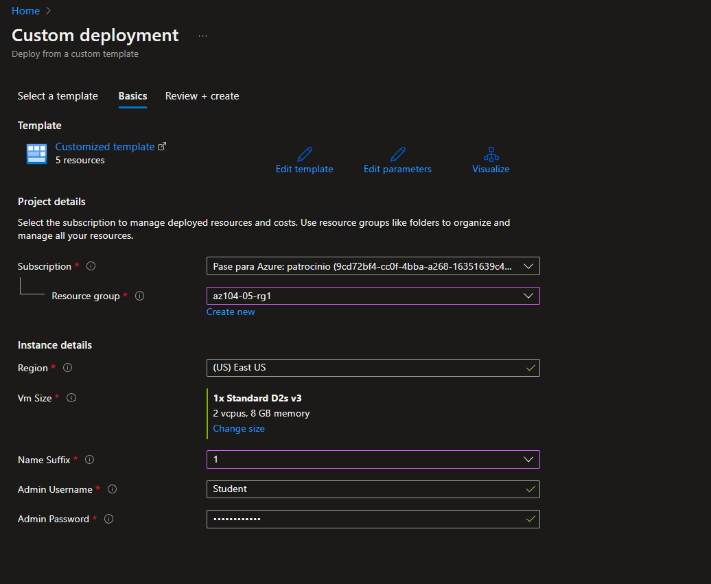

7. Cuando se haya creado y le demos a **Go to resource** veremos que gracias al json ya se han creado la máquina virtual, la red virtul, el nsg, etc.

   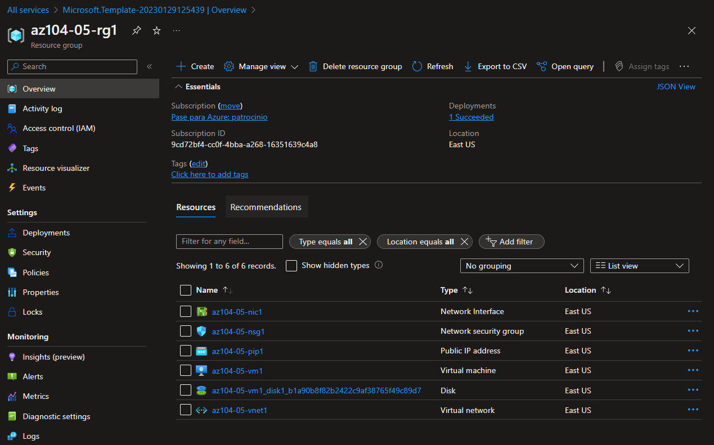

8. Tendremos que hacer el mismo procedimiento de antes pero creando el grupo de recursos **az104-05-rg0**, con la misma **Region** que el grupo de recursos antes creado (**East US**) y el **Name Suffix** será **0**.

   

   9. Le daremos a **Review + Create** y después a **Create**.

   10. Por último tendremos que seguir el mismo procedimiento, pero en este caso llamaremos a nuestro grupo de recursos **az104-05-rg2** y cambiaremos la **Region** a **West US** y el **Name Suffix** será **2**.

       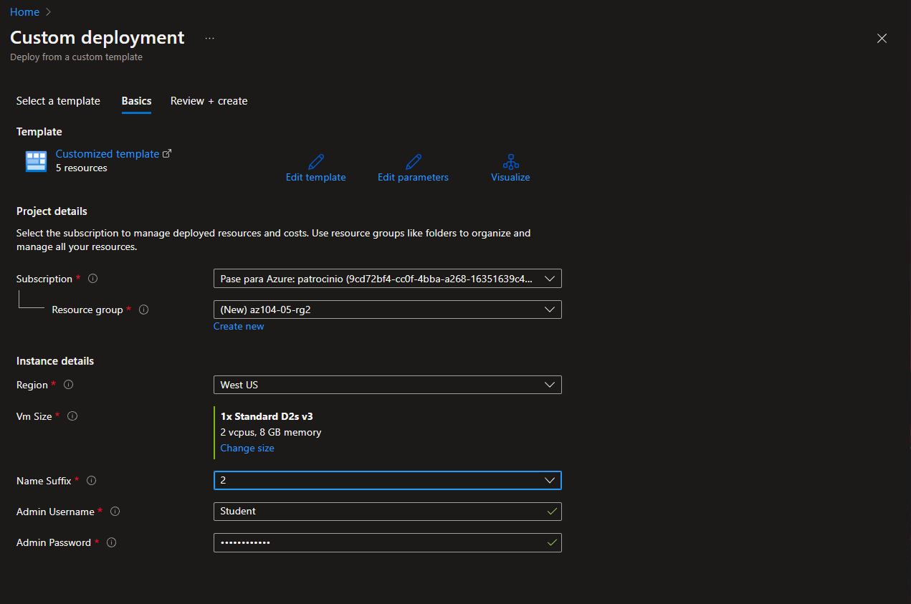

### TASK 2: Configurar el emparejamiento (peering) de las LAN y WAN.

1. En Azure Portal, buscamos y seleccionamos **Virtual networks**.

2. Revisamos las redes virtuales que creamos en la tarea anterior y verificamos que las dos primeras estan ubicadas en la misma región de Azure (**East US**) y la tercera en una región de Azure diferente (**West US**).

   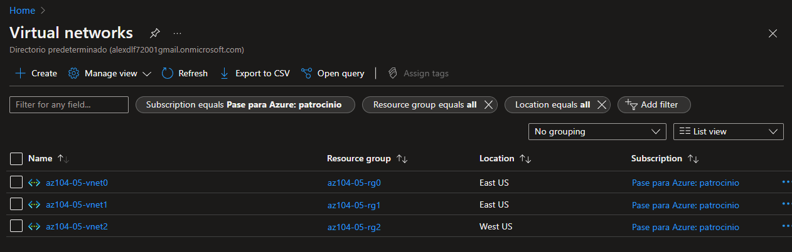

3. En la lista de redes virtuales, hacemos clic en **az104-05-vnet0** .

4. En la hoja de red virtual **az104-05-vnet0** , en la sección **Settings**, hacemos clic en **Peerings**y luego haga clic en **+ Add**.

5. Agregaremos un emparejamiento con la siguiente configuración (dejaremos los demás con sus valores predeterminados) y hacemos clic en **Add** :

   | Setting                                                      | Value                                                        |
   | :----------------------------------------------------------- | :----------------------------------------------------------- |
   | This virtual network: Peering link name                      | **az104-05-vnet0_to_az104-05-vnet1**                         |
   | This virtual network: Traffic to remote virtual network      | **Allow (default)**                                          |
   | This virtual network: Traffic forwarded from remote virtual network | **Block traffic that originates from outside this virtual network** |
   | Virtual network gateway                                      | **None**                                                     |
   | Remote virtual network: Peering link name                    | **az104-05-vnet1_to_az104-05-vnet0**                         |
   | Virtual network deployment model                             | **Resource manager**                                         |
   | I know my resource ID                                        | unselected                                                   |
   | Subscription                                                 | the name of the Azure subscription you are using in this lab |
   | Virtual network                                              | **az104-05-vnet1**                                           |
   | Traffic to remote virtual network                            | **Allow (default)**                                          |
   | Traffic forwarded from remote virtual network                | **Block traffic that originates from outside this virtual network** |
   | Virtual network gateway                                      | **None**                                                     |

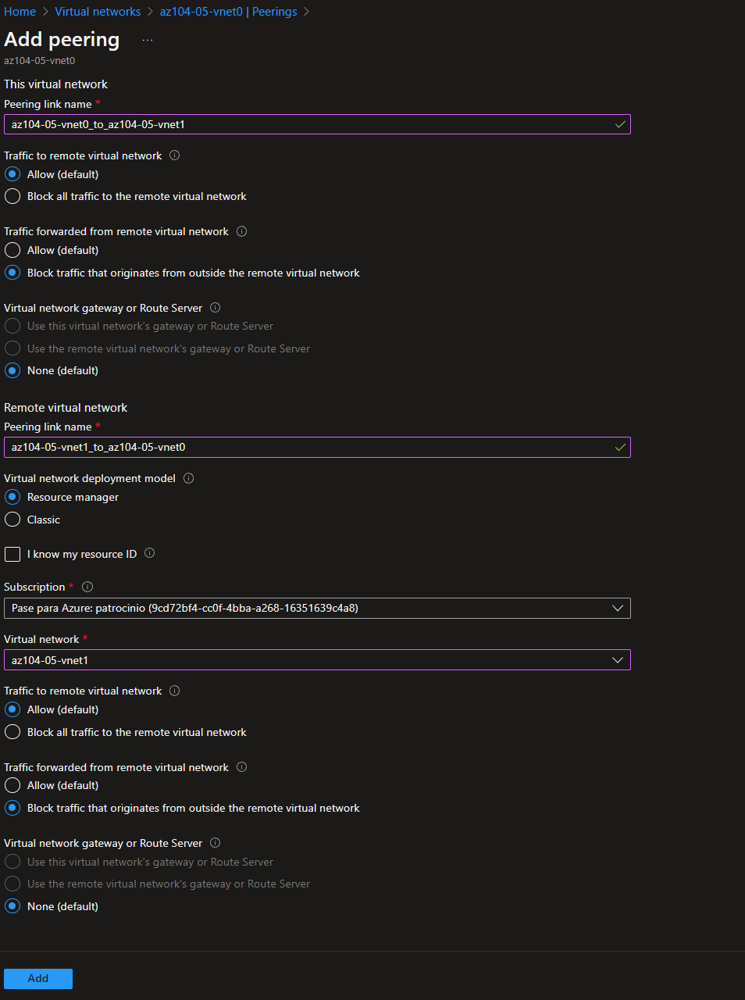

6. Este paso establece dos emparejamientos locales: uno de az104-05-vnet0 a az104-05-vnet1 y el otro de az104-05-vnet1 a az104-05-vnet0.

7. En la hoja de red virtual **az104-05-vnet0** , en la sección **Settings**, hacemos clic en **Peerings** y luego hacemos clic en **+ Add** .

8. Agregamos el emparejamiento con la siguiente configuración (dejamos los demás con sus valores predeterminados) y haga clic en **Add** :

   | Setting                                                      | Value                                                        |
   | :----------------------------------------------------------- | :----------------------------------------------------------- |
   | This virtual network: Peering link name                      | **az104-05-vnet0_to_az104-05-vnet2**                         |
   | This virtual network: Traffic to remote virtual network      | **Allow (default)**                                          |
   | This virtual network: Traffic forwarded from remote virtual network | **Block traffic that originates from outside this virtual network** |
   | Virtual network gateway                                      | **None**                                                     |
   | Remote virtual network: Peering link name                    | **az104-05-vnet2_to_az104-05-vnet0**                         |
   | Virtual network deployment model                             | **Resource manager**                                         |
   | I know my resource ID                                        | unselected                                                   |
   | Subscription                                                 | the name of the Azure subscription you are using in this lab |
   | Virtual network                                              | **az104-05-vnet2**                                           |
   | Traffic to remote virtual network                            | **Allow (default)**                                          |
   | Traffic forwarded from remote virtual network                | **Block traffic that originates from outside this virtual network** |
   | Virtual network gateway                                      | **None**                                                     |

9. Volvemos a la hoja **Virtual networks** y, en la lista de redes virtuales, hacemos clic en **az104-05-vnet1** .

10. En la hoja de red virtual **az104-05-vnet1** , en la sección **Settings**, hacemos clic en **Peerings** y luego hacemos clic en **+ Agregar** .

11. Agregamos un emparejamiento con la siguiente configuración (dejamos los demás con sus valores predeterminados) y hacemos clic en **Add** :

    | Setting                                                      | Value                                                        |
    | :----------------------------------------------------------- | :----------------------------------------------------------- |
    | This virtual network: Peering link name                      | **az104-05-vnet1_to_az104-05-vnet2**                         |
    | This virtual network: Traffic to remote virtual network      | **Allow (default)**                                          |
    | This virtual network: Traffic forwarded from remote virtual network | **Block traffic that originates from outside this virtual network** |
    | Virtual network gateway                                      | **None**                                                     |
    | Remote virtual network: Peering link name                    | **az104-05-vnet2_to_az104-05-vnet1**                         |
    | Virtual network deployment model                             | **Resource manager**                                         |
    | I know my resource ID                                        | unselected                                                   |
    | Subscription                                                 | the name of the Azure subscription you are using in this lab |
    | Virtual network                                              | **az104-05-vnet2**                                           |
    | Traffic to remote virtual network                            | **Allow (default)**                                          |
    | Traffic forwarded from remote virtual network                | **Block traffic that originates from outside this virtual network** |
    | Virtual network gateway                                      | **None**                                                     |

### TASK 3: Probar la conectividad entre sitios.

1. En Azure Portal, buscamos y seleccionamos **Virtual machines**.

2. En la lista de máquinas virtuales, hacemos clic en **az104-05-vm0** .

3. En la hoja **az104-05-vm0** , hacemos clic en **Connect**, en el menú desplegable, hacemos clic en **RDP** , en la hoja **Connect with RDP**, hacemos clic en **Download RDP File** y seguimos las indicaciones para iniciar la sesión de Escritorio remoto.

   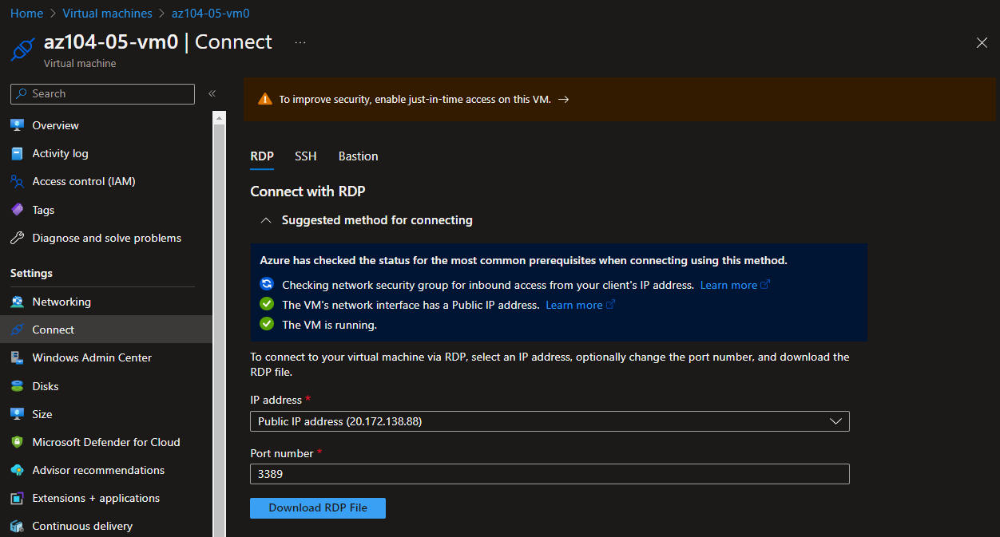

4. Iniciamos sesión con el nombre de usuario del **Student** y la contraseña de su archivo de parámetros.

5. Dentro de la sesión de Escritorio remoto a **az104-05-vm0** , hacemos clic con el botón derecho en el botón **Inicio** y, en el menú contextual, hacemos clic en **Windows PowerShell (Administrador)**.

6. En la ventana de la consola de Windows PowerShell, ejecutamos lo siguiente para probar la conectividad con **az104-05-vm1** (que tiene la dirección IP privada de **10.51.0.4** ) a través del puerto TCP 3389:

   `Test-NetConnection -ComputerName 10.51.0.4 -Port 3389 -InformationLevel 'Detailed'`

7. Examinamos el resultado del comando y verificamos que la conexión se haya realizado correctamente.

8. En la ventana de la consola de Windows PowerShell, ejecutamos lo siguiente para probar la conectividad con **az104-05-vm2** (que tiene la dirección IP privada de **10.52.0.4** ):

   `Test-NetConnection -ComputerName 10.52.0.4 -Port 3389 -InformationLevel 'Detailed'`

   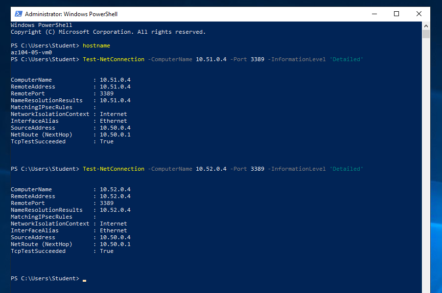

9. Volvemos a Azure Portal y volvemos a la hoja de **Virtual machines**.

10. En la lista de máquinas virtuales, hacemos clic en **az104-05-vm1** .

11. En la hoja **az104-05-vm1** , hacemos clic en **Connect** , en el menú desplegable, hacemos clic en **RDP** , en la hoja **Connect with RDP**, hacemos clic en **Download RDP File** y siguemos las indicaciones para iniciar la sesión de Escritorio remoto.

12. Iniciamos sesión con el nombre de usuario del **Student** y la contraseña de su archivo de parámetros.

13. Dentro de la sesión de Escritorio remoto a **az104-05-vm1** , hacemos clic con el botón derecho en el botón **Inicio** y, en el menú contextual, hacemos clic en **Windows PowerShell (Administrador)**.

14. En la ventana de la consola de Windows PowerShell, ejecutamos lo siguiente para probar la conectividad con **az104-05-vm2** (que tiene la dirección IP privada de **10.52.0.4**) a través del puerto TCP 3389:

    `Test-NetConnection -ComputerName 10.52.0.4 -Port 3389 -InformationLevel 'Detailed'`

    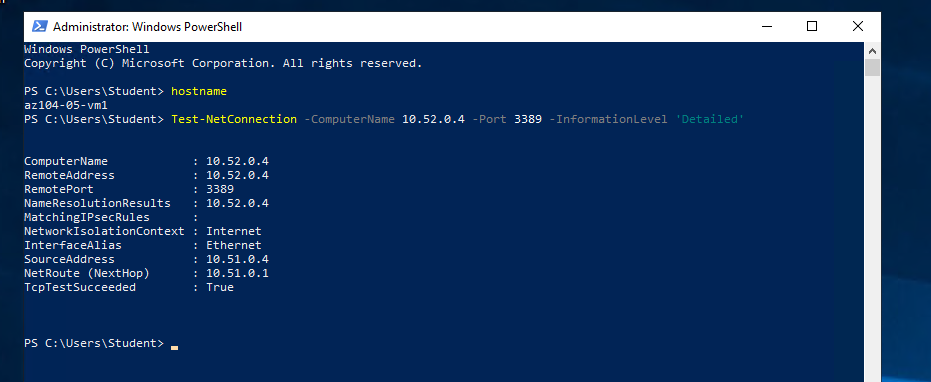

15. Examinamos el resultado del comando y verificamos que la conexión se haya realizado correctamente.